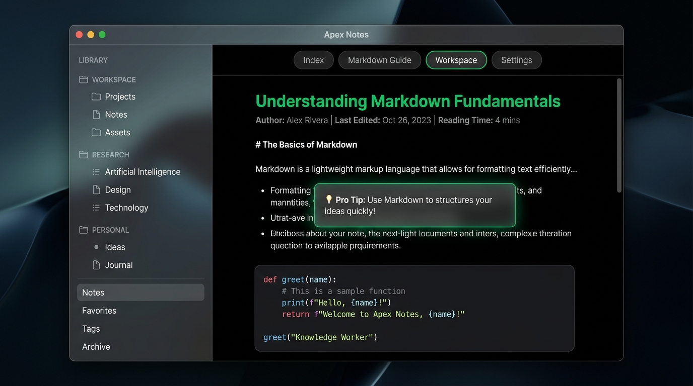

<div align="center">

# ✨ Wykiati Obsidian Theme
### Ultra-Premium OLED Pure Black & Translucent Glassmorphism Theme for Obsidian

[](https://obsidian.md)
[](LICENSE)
[](manifest.json)
[](#compatibility)

<br/>



<br/>

**Wykiati** transforms Obsidian into a state-of-the-art, distraction-free knowledge sanctuary. Built from the ground up for **OLED displays** with **100% Pure Black (`#000000`)** foundation, modern **iOS/macOS-inspired glassmorphic translucency**, and vibrant dynamic accents.

</div>

---

## 🌟 Key Highlights

- 🖤 **100% OLED Pure Black (`#000000`)** — True pitch-black editor canvas for absolute focus, zero eye fatigue, and maximum power efficiency on OLED screens.
- 🪟 **Frosted Glass Panels** — Translucent sidebars, floating modals, quick switchers, and menus using real hardware-accelerated `backdrop-filter: blur()`.
- ⚡ **Vibrant Dynamic Accents** — Curated neon palettes (Emerald, Cyber Cyan, Neon Violet, Solar Amber, Crimson Rose, Monochrome, and retro classics like Catppuccin, Dracula, Gruvbox & One Dark).
- 🔍 **Showpiece Command Palette** — Floating translucent glass modal with sleek input and keyboard shortcut badges.
- 🏷️ **Apple-Style Properties** — Refined metadata frontmatter cards with modern pill tags.
- 💬 **Glassmorphism Callouts** — Translucent tinted callouts with glowing side accents and crisp typography.
- 💻 **Premium Code Blocks** — Ultra-dark glass code surfaces with custom language flair badges, animated copy buttons, and 7 syntax highlighting themes.
- ☑️ **Custom Checkboxes & Task Glyphs** — Animated iOS-style toggles and extended markdown task bullet icons (`- [!]`, `- [?]`, `- [*]`, `- [i]`, etc.).
- 📱 **Mobile & Desktop Parity** — Tailored touch targets, single-row mobile toolbar layout, and fluid responsiveness across Windows, macOS, Linux, iOS, and Android.
- 🎛️ **Full Style Settings Integration** — Customize accents, glass intensity, fonts, headers, and callouts with zero CSS hacking.

---

## 📸 Interface Showcase

| Feature | Description |
| :--- | :--- |
| **OLED Editor** | Pure `#000000` background with high-contrast text (`#ededed`) for comfortable long reading & writing sessions. |
| **Glass Sidebars** | Translucent file explorer with dedicated file type icons and clean hierarchy guides. |
| **Pill Tabs** | Sleek active tab indicator with subtle border glow and integrated close buttons. |
| **Focus Mode** | Subtly dims sidebars and toolbars when typing to keep your attention strictly on your ideas. |

---

## 🚀 Installation

### Method 1: Obsidian Community Themes (Recommended)
1. In Obsidian, open **Settings** (`Ctrl+,` or `Cmd+,`).
2. Navigate to **Appearance** → **Themes** → **Manage**.
3. Search for `Wykiati`.
4. Click **Install and apply**.

### Method 2: Manual Installation
1. Download `theme.css` and `manifest.json` from the latest [GitHub Release](https://github.com/wykiati/wykiati-obsidian-theme/releases).
2. Open your Obsidian Vault folder and go to `.obsidian/themes/`.
3. Create a folder named `Wykiati` and paste `theme.css` and `manifest.json` inside.
4. In Obsidian, go to **Settings** → **Appearance** → **Theme** and select **Wykiati**.

---

## 🎛️ Customization with Style Settings

Wykiati is deeply integrated with the [Style Settings](https://github.com/mgmeyers/obsidian-style-settings) community plugin.

### Available Options:
- **Appearance & Colors**:
  - Color Presets: *Wykiati Emerald (Default)*, *Cyber Cyan*, *Neon Violet*, *Solar Amber*, *Crimson Rose*, *Monochrome Minimal*, *Gruvbox OLED*, *Catppuccin Mocha OLED*, *Dracula OLED*, *One Dark OLED*.
  - Custom Accent Color Picker (override globally).
  - Custom Background Color (default: `#000000`).
- **Glassmorphism & Focus**:
  - Focus Mode toggle.
  - Background noise texture toggle.
  - Note title gradient toggle.
  - Bold text gradient accent toggle.
- **Headers & Typography**:
  - Heading Styles: *Modern Clean*, *Glass Box*, *Lodi Underline*, *Neat Pill*, *Outline*, *Dots*, *Cross*.
  - Font switcher: Built-in bundled fonts (*Figtree* & *JetBrains Mono*) or Native System Fonts.
- **Callouts & Code**:
  - Callout Styles: *Wykiati Modern Glass*, *Floating Title*, *Glow Accent*, *Minimal Outline*.
  - Syntax Highlighting: *Wykiati Neon*, *Tokyo Night*, *GitHub Dark*, *Catppuccin*, *Dracula*, *One Dark*, *Halcyon*.
- **Navigation**:
  - Auto-hide Tab bar, Status bar, or Ribbon until hovered.
  - Minimal File Tree (hide arrows).
  - Mobile single-row compact toolbar layout & vertical offset.

---

## 🖥️ Compatibility

| Operating System | Obsidian Desktop | Obsidian Mobile | Live Preview | Reading View | Canvas | Graph View |
| :---: | :---: | :---: | :---: | :---: | :---: | :---: |
| **Windows 10/11** | ✅ | — | ✅ | ✅ | ✅ | ✅ |
| **macOS** | ✅ | — | ✅ | ✅ | ✅ | ✅ |
| **Linux** | ✅ | — | ✅ | ✅ | ✅ | ✅ |
| **iOS / iPadOS** | — | ✅ | ✅ | ✅ | ✅ | ✅ |
| **Android** | — | ✅ | ✅ | ✅ | ✅ | ✅ |

---

## 🛠️ Development & Building from Source

To customize or build the theme locally:

```bash
# Clone the repository
git clone https://github.com/wykiati/wykiati-obsidian-theme.git
cd wykiati-obsidian-theme

# Install build dependencies
npm install

# Watch mode for live development
npm run dev

# Build production minified theme.css
npm run build
```

---

## 🗺️ Roadmap

- [x] Full OLED `#000000` base architecture
- [x] Hardware-accelerated glassmorphism design system
- [x] Style Settings complete integration
- [x] Mobile single-row toolbar layout
- [x] Custom task checkboxes & file tree icons
- [ ] Additional community plugin styling modules (Dataview, Excalidraw, Omnisearch)
- [ ] Custom Obsidian Canvas card styles

---

## 📜 License & Credits

- Distributed under the **MIT License**. See [LICENSE](LICENSE) for details.
- Architectural foundations and SVG icon assets evolved from [Glass Robo](https://github.com/lorens-osman-dev/Glass-Robo) by **Lorens Osman** & **Daniel (@Avesend)**.
- Fonts: [Figtree](https://github.com/erikdkennedy/figtree) (OFL) by Erik Kennedy, [JetBrains Mono](https://github.com/JetBrains/JetBrainsMono) (OFL) by JetBrains.

---

<div align="center">
  <b>Designed with ❤️ for high-performance knowledge workers.</b>
</div>
